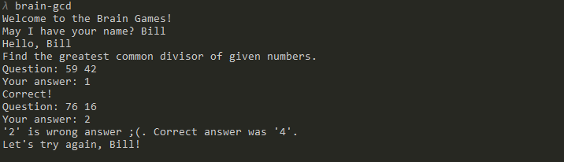

### Brain Games
[](https://github.com/s-peftev/frontend-project-lvl1/actions)  [](https://codeclimate.com/github/s-peftev/frontend-project-lvl1/maintainability)  [](https://github.com/s-peftev/frontend-project-lvl1/actions)

Game pack of 5 simple console games.

### Install

```console
git clone git@github.com:s-peftev/frontend-project-lvl1.git
cd frontend-project-lvl1
make install
npm link
```

* Brain Games Menu

```console
brain-games-menu
=== BRAIN-GAMES ===
===     MENU    ===

[1] Brain-Even
[2] Brain-Calc
[3] Brain-GCD
[4] Brain-Progression
[5] Brain-Prime
[0] CANCEL

Choose a game to play. [1...5 / 0]:
```

Start playing from main menu or run each game directly.

* Brain Even


* Brain Calc


* Brain GCD




* Brain Progression


* Brain Prime


